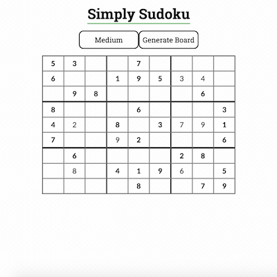
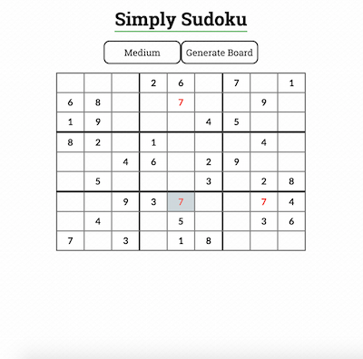
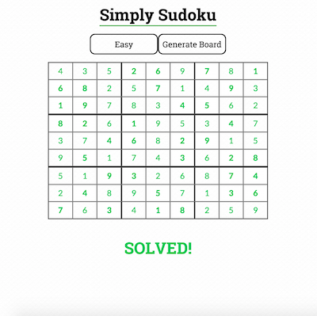

# Simply Sudoku
*A responsive sudoku app created with JavaScript, jQuery, Jade, and Sass.*

## How to Play
Visit the following link to play:
[http://kalevrk.github.io/SimplySudoku/](http://kalevrk.github.io/SimplySudoku/)

- Click on highlighted cells to change their value
- Enter a number (1-9) into the input field and hit enter to update the value
- Conflicts are highlighted in red
- Fill in all of the values without conflicts to solve the board
- Click on the difficulty button to select a board difficulty
- Click on the 'Generate Board' button to generate a new board

## Screenshots

## Setup
1. Clone down the repo.
2. In the root folder of the repo run `npm install`.
3. Run `gulp` to run tests, build the files, and watch for changes (additional gulp tasks are in the *gulpfile.js* file).
4. Open the *index.html* from the *dist/src* directory to see the latest version of the game.

## Technologies Used
- **Template Engine**: Jade
- **CSS Preprocessor**: Sass
- **Scripting**: JavaScript, jQuery
- **Module Loader**: Browserify
- **Testing Framework**: Mocha
- **Assertion Library**: Chai
- **Build System**: Gulp

## Project Structure
At a high level, the project structure is divided between:

* **js**
  * *Scripts for event handling, DOM manipulation, loading and updating game boards, and checking game state*
* **styles**
  * *Sass file for styling the app*
* **templates**
  * *Jade template for structuring the app*

Within the **js** directory, the application logic is divided between the following files:

* **app.js**
  * *Includes all of the logic for DOM manipulation and event handling using jQuery. Calls methods from board.js for retrieving and modifying the game board*
* **board.js**
  * *Includes all of the logic for storing and manipulating the game board state. Retrieves board data from board-data.js*
* **board-data.js**
  * *Stores by difficulty all of the available game boards along with their corresponding solution boards*

## Design Decisions
- **Game Features**
  - There was some flexibility with what sudoku game features to include in this application. I hadn't played sudoku in a while, so I did some research on what some of the different representations of the game were online, and decided on a feature set and style that appealed to me.
  - I wanted to focus on a clean minimalist design. I wanted it to be easy for the user to change values in mutable cells on the board, and see what conflicts occur.
  - It was also important to me to include boards of varying difficulties and allow the user to generate new boards easily. Unfortunately, I didn't have time to implement an actual board generator, but this is a feature that I would love to build out.
- **Template Engines and Preprocessors**
  - While I had used template engines such as Handlebars before, I hadn't used the Jade before, and I wanted to use this project as opportunity to try it out. I'm glad that I did because I really love the whitespace sensitive style, and it made writing the HTML template so much easier, while still maintaining readability. It was also really easy to integrate into my build process through the `gulp-jade` npm module.
  - I haven't used CSS preprocessors such as Sass that much, but I also saw this as an opportunity to use it as well. While I still enjoy writing vanilla CSS more, and I believe that there are advantages and trade-offs to either approach, it was a good chance to get more expsoure, and also incorporate the Sass compilation into my build process.
- **Responsive Design**
  - In order to create a responsive design for my application, I focused on using CSS3 media queries, relative units, and testing my application using the `User-Agent Switcher for Chrome` extension.
  - After creating a baseline responsive game board, I set breakpoints at key width resolutions, and set the width of my game board to adjust, so that it wouldn't stretch or contract too much at any resolution. I also focused on making sure that the presentation and functionality was good even at lower resolutions. The minimal presentation of the sudoku game helped in this regard. 
- **Testing**
  - I believe that testing is very important to any sort of software development work, and I came into this project with a TDD approach. Before I started development, I went through the feature list for the game, and planned out key pieces of functionality. Then I setup unit tests using the `Mocha` JavaScript testing framework with the `Chai` assertion library.
  - In order to test my JavaScript functions, as well as check for actual updates to the DOM, I shimmed jQuery into my test file using the `browserify-shim` module.
  - As I implemented each feature, I implemented the corresponding tests and developed until the tests passed, and I saw the expected functionality on the app itself.
- **Build System**
  - I'm a big fan of Gulp's streaming build system, and especially with the Jade and Sass compilation that I was doing for this project, I wanted to have a solid gulpfile setup to automate my development tasks.
  - I took a gulpfile that I had developed for a previous project, and then modified it to include Jade and Sass compilation.
  - For development I setup the following tasks:
    - linting
    - module loading
    - compilation
    - testing
    - watching files for changes
  - I also setup build tasks for:
    - uglification/minification
    - moving files to the appropriate directories
- **Seperation of Logic**
  - From the beginning of planning out this project, I wanted to maintain separation of concerns as much as possible. The Project Structure section above gives an outline of how this separation was done.
  - I wanted to keep all event handling and DOM manipulation code separate from code that handled the actual state of the underlying game board data.
  - Using `Browerserify` also helped keep the code clean, and allowed me to only require modules where they were actually needed. 
- **Storing Board Data**
  - There are many ways that the game board data could be stored, and before starting development I considered different ways to store it.
  - I went with the approach that I did, where there are game boards and corresponding solution boards stored as arrays of values because I wanted to make it easy to add new boards.
  - Ultimately, I would love to build out a board generator for the application, but I did not have the time to do so right now.
  - I still wanted to allow the user to play boards of varying difficulty, and I'm glad that I planned for that from the beginning.
- **Future Features**
  - Based on the current state of the application, the next thing that I would love to add on would be an automatic board generator. I think that the core application is solid and easy to use, so it would be nice to allow it to be used for a large variety of boards.
  - It would also be great to have user accounts and track how much time the user took to complete each board, and compare their times to other users' times.
  